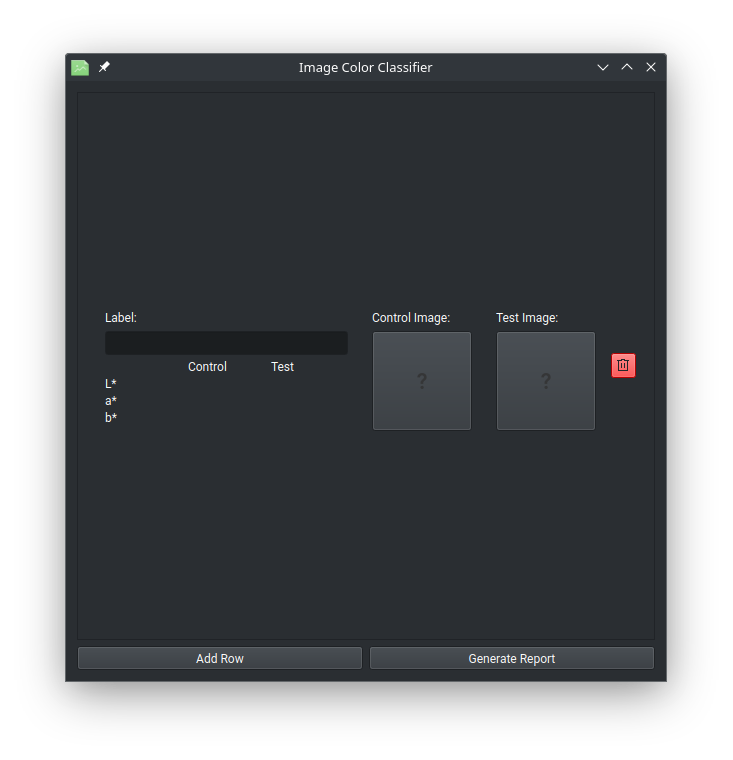
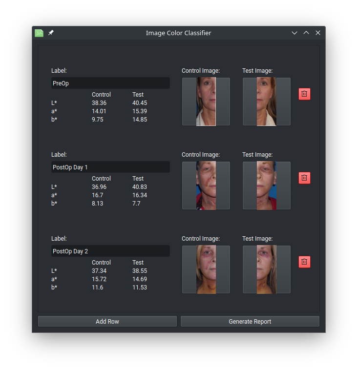
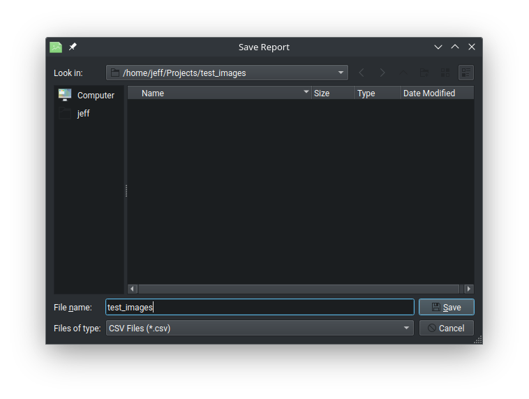
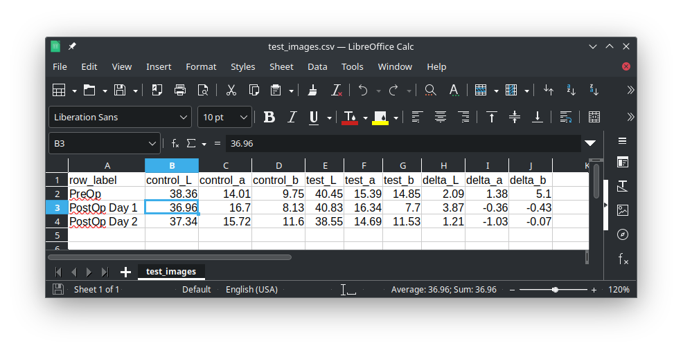

# ImageColorClassifier

The ImageColorClassifier is a GUI or CLI application used to generate average
channel values for a set of images in the CIELAB color space. The objective is
to provide a framework for objectively measuring color differences between a
control and expirement photo set, specifically to quantify the effect of various
treatment methodologies on post-operative bruising. 

# Run the application

## From Release

The releases section will contain compiled single-file executables. These can be
run directly from your file explorer or executed from the command line. In
either case, the GUI will launch allowing you to load images for analysis.

## From Source

### Prerequisits
* Python 3 should be installed on your system

### Setup your environment
Linux: 

```bash
$ python3 -m venv env
$ source env/bin/activate
(env) $ pip install -r requirements.txt
```

Windows: 
```cmd
> python -m venv env
> env\Scripts\activate.bat
(env) > pip install -r requirements
```

### Execution

To run the full GUI application, simply execute:
```bash
(env) $ python ImageColorClassifier.py
```

# Using the Application


The application will start with a single row of un-labeled, un-populated image
controls. Clicking the image controls labeled "Control" and "Test" will allow
you to browse for an image file on your local computer. The 'Label' is meant to
briefly describe the meaning of the two images.


The above is an example of multiple post-operative photographs loaded along with
the pre-operative photographs. As photographs are loaded for each row the
average LAB channel values are populated below the row label. Any number of rows
may be added. Rows may be removed with the delete icon on the right hand side.


Once all desired images are loaded, use the 'Generate Report' button to output
the calculated average LAB values in a CSV file. Once the report has been
generated you will be prompted if you would like to open the containing folder.


The report shows the average L*, a*, and b* channel values for the control and
test images of each row, along with the difference between the two. Average
values are calculated by first converting the RGB image into the CIELAB color
space, then generating a histogram of the color values for each channel.

The averages for the a and b channels are calculated by multiplying the value in
each bucket of the histogram by that bucket's index. This number is then divided
by the total number of pixels to get the average value. Both channels have
values ranging from -128 to 127, but the index values will be between 0 and
255. To get the actual average value then, we subtract 128 from the initial
result.

The l chanel should have a value between 0 and 100, but again our histogram has
index values between 0 and 255. To get the desired l value then, we take the
initial average and then divide by 2.55.

This approach gives us meaningful average values for each channel that can be
used for analysis. For example, a positive shift in the a* channel indicates
that the image has more red tones in it, while a negative b* shift indicates
more blue tones. We Would expect heavy bruising to be reflected in these shifts.


# Using the CLI
The program also provides a CLI, though there are some differences in the report
generation between the two interfaces. The CLI can be invoked from the terminal
by passing arguments to the executable or python script. When no arguments are
passed, the GUI is launched instead.

### Single image analysis
```bash
$ python image_histogram.py -p path-to-image -o output-name
```

This command will generate two output files:

**output-name_summary.csv**

Calculated averages for the channels. 
|id|desc|avgL|avgA|avgB|
|--|----|----|----|----|
|1|Pre-op left-side|38.35|14.0|9.74|

The averages for the a and b channels are calculated by multiplying the value in
each bucket of the histogram by that bucket's index. This number is then divided
by the total number of pixels to get the average value. Both channels have
values ranging from -128 to 127, but the index values will be between 0 and
255. To get the actual average value then, we subtract 128 from the initial
result.


# Building

This program was built on the OpenSUSE operating system, but is intended to run
on Windows. To create a Windows executable from the Linux environment, the
following commands are required.

```bash
$ sudo zypper install wine
$ wget https://www.python.org/ftp/python/3.9.13/python-3.9.13-amd64.exe
$ wine python-3.9.13-amd64.exe
$ wine python -m pip install -r requirements.txt
$ wine pyinstaller --onefile ImageColorClassifier.py
```

This will create a window executable in `./dist/ImageColorClassifier.exe`. 


# image_histogram
The image_histogram module is a stand-alone CLI application for generating
histogram data about an image or set of images in the CIELAB color space. It
will provide a raw output of the histogram for the image(s), as well as a final
output with average values based on those histograms.

## Example usages

### Single Image
When only a single image is passed, the output will indicate that this image is
the 'pre-operative left side' image. The tool was written to allow for
comparison between left and right side post-operative bruising, and the outputs
reflect this. No special processing is done here; it is only a textual
consideration

```bash
$ python image_histogram.py -p path-to-image -o output-name
```

This command will generate two output files:

**output-name_summary.csv**

Calculated averages for the channels. 
|id|desc|avgL|avgA|avgB|
|--|----|----|----|----|
|1|Pre-op left-side|38.35|14.0|9.74|

The averages for the a and b channels are calculated by multiplying the value in
each bucket of the histogram by that bucket's index. This number is then divided
by the total number of pixels to get the average value. Both channels have
values ranging from -128 to 127, but the index values will be between 0 and
255. To get the actual average value then, we subtract 128 from the initial
result.

The l chanel should have a value between 0 and 100, but again our histogram has
index values between 0 and 255. To get the desired l value then, we take the
initial average and then divide by 2.55.

**output-name.csv**

The raw histogram data for each channel:
|pre_left_L|pre_left_a|pre_left_b|
|----------|----------|----------|
|0|0|0|

### Complete Patient Image Collection
Running the script for a complete set of patient operative photographs,
including photos pre-operatively as well as on days 1 and 7 post-operative. 

```bash
$ python image_histogram.py \
> --preop-left test_images/PreOpLeft.png \
> --preop-right test_images/PreOpRight.png \
> --postop-left test_images/PostOpDay1Left.png test_images/PostOpDay7Left.png \
> --postop-right test_images/PostOpDay1Right.png test_images/PostOpDay7Right.png \
> --output patient_12345
```

**patient_12345_summary.csv**

Here we have added additional comparisons between the post-op photos and the
pre-op photo. Post-operative photos are simply labled by the order they are
passed in, which is why it is essential that the order is consistent between the
left and the right side. The comparisons are included here for convenience, but
can easyl be calculated from the values provided.
|id|desc|avgL|avgA|avgB|
|--|----|----|----|----|
|1|Pre-op left-side|38.36|14.01|9.75|
|2|Post-op 1 left-side|36.96|16.7|8.13|
|3|Difference Post-op 1 left-side vs Pre-op left side|-3.49|1.31|-6.72|
|4|Post-op 2 left-side|37.34|15.72|11.6|
|5|Difference Post-op 2 left-side vs Pre-op left side|-3.11|0.33|-3.25|
|6|Pre-op right-side|40.45|15.39|14.85|
|7|Post-op 1 right-side|40.83|16.34|7.7|
|8|Difference Post-op 1 right-side vs Pre-op right side|0.38|0.95|-7.15|
|9|Post-op 2 right-side|38.55|14.69|11.53|
|10|Difference Post-op 2 right-side vs Pre-op right side|-1.90|-0.70|-3.32|
